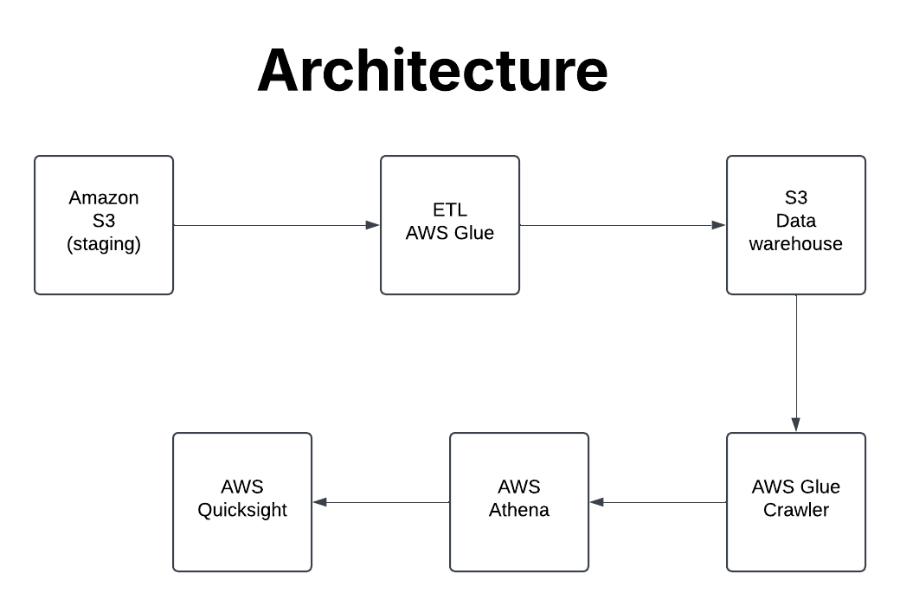

# End-to-End Spotify Data Engineering Pipeline

## Overview

This project demonstrates an end-to-end data engineering pipeline for processing Spotify data using AWS services. The pipeline extracts data from various sources, transforms it using AWS Glue, and loads it into a data warehouse for analysis. The architecture leverages AWS S3 for storage, AWS Glue for ETL (Extract, Transform, Load) processes, and AWS Quicksight and Athena for data visualization and querying.

## Data Source
The dataset used in this project is available on Kaggle. It canbe accessed using the following link:
https://www.kaggle.com/datasets/tonygordonjr/spotify-dataset-2023

## Project Architecture

The architecture of the project is designed to handle large-scale data processing efficiently. Below is a high-level overview of the components involved:

1. **Data Sources**: 
   - **S3 Bucket**: Raw data is stored in an S3 bucket, which includes information about albums, artists, and tracks.

2. **ETL Process**:
   - **AWS Glue**: The ETL process is managed by AWS Glue, which performs the following tasks:
     - **Data Extraction**: Data is extracted from the S3 bucket.
     - **Data Transformation**: The data undergoes various transformations, including joining datasets (e.g., album and artist data) and dropping unnecessary fields.
     - **Data Loading**: The transformed data is loaded back into S3 for further analysis.

3. **Data Warehouse**:
   - **Amazon S3**: The processed data is stored in an S3 bucket, which acts as a staging area for the data warehouse.

4. **Data Analysis**:
   - **AWS Athena**: Used for querying the processed data stored in S3.
   - **AWS Quicksight**: Provides visualization capabilities to analyze and present the data insights.

## Visual ETL Diagram

The ETL process is visualized in the following steps:

1. **Data Sources**:
   - **Album**: Data related to Spotify albums.
   - **Artist**: Data related to Spotify artists.
   - **Track**: Data related to Spotify tracks.

2. **Transformations**:
   - **Join**: The album and artist datasets are joined to create a unified dataset.
   - **Join with Tracks**: The unified dataset is further joined with track data.
   - **Drop Fields**: Unnecessary fields are dropped to streamline the dataset.

3. **Data Target**:
   - **Amazon S3**: The final transformed data is stored in an S3 bucket for further analysis.

### Prerequisites

- AWS Account with necessary permissions to use S3, AWS Glue, Athena, and Quicksight.
- Basic understanding of AWS services and data engineering concepts.

### Steps to Reproduce

1. **Set Up S3 Buckets**:
   - Create S3 buckets to store raw and processed data.

2. **Configure AWS Glue**:
   - Set up AWS Glue jobs to perform the ETL process.
   - Define the necessary transformations, such as joining datasets and dropping fields.

3. **Run the ETL Process**:
   - Execute the AWS Glue jobs to process the data.

4. **Analyze Data**:
   - Use AWS Athena to query the processed data.
   - Visualize the data using AWS Quicksight.

## Conclusion

This project showcases a robust data engineering pipeline for processing Spotify data using AWS services. By leveraging AWS Glue for ETL, S3 for storage, and Athena and Quicksight for analysis, the pipeline provides a scalable and efficient solution for handling large datasets. This project is a great example of how to build a modern data engineering pipeline in the cloud.
